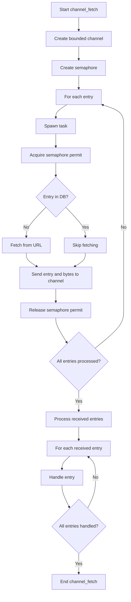

```mermaid
flowchart TD
    A[Start channel_fetch] --> B[Create bounded channel]
    B --> C[Create semaphore]
    C --> D[For each entry]
    D --> E[Spawn task]
    E --> F[Acquire semaphore permit]
    F --> G{Entry in DB?}
    G -->|No| H[Fetch from URL]
    G -->|Yes| I[Skip fetching]
    H --> J[Send entry and bytes to channel]
    I --> J
    J --> K[Release semaphore permit]
    K --> L{All entries processed?}
    L -->|No| D
    L -->|Yes| M[Process received entries]
    M --> N[For each received entry]
    N --> O[Handle entry]
    O --> P{All entries handled?}
    P -->|No| N
    P -->|Yes| Q[End channel_fetch]
```
