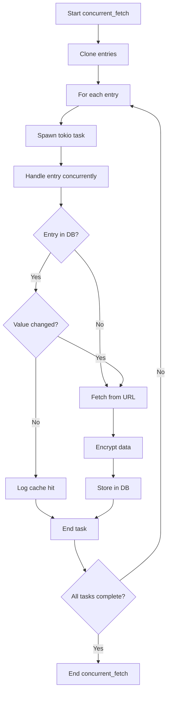

```mermaid
flowchart TD
    A[Start concurrent_fetch] --> B[Clone entries]
    B --> C[For each entry]
    C --> D[Spawn tokio task]
    D --> E[Handle entry concurrently]
    E --> F{Entry in DB?}
    F -->|Yes| G{Value changed?}
    F -->|No| H[Fetch from URL]
    G -->|Yes| H
    G -->|No| I[Log cache hit]
    H --> J[Encrypt data]
    J --> K[Store in DB]
    I --> L[End task]
    K --> L
    L --> M{All tasks complete?}
    M -->|No| C
    M -->|Yes| N[End concurrent_fetch]
```
