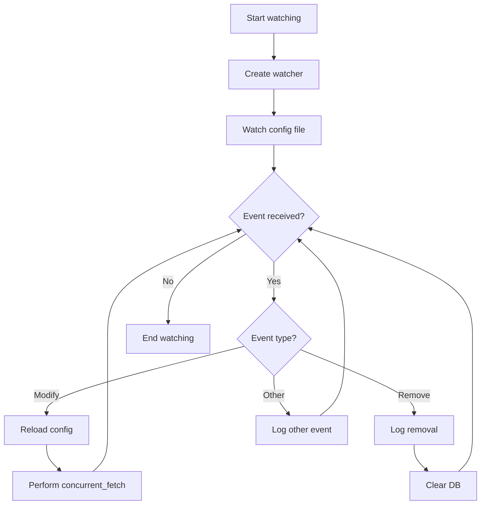

```mermaid
flowchart TD
    A[Start watching] --> B[Create watcher]
    B --> C[Watch config file]
    C --> D{Event received?}
    D -->|Yes| E{Event type?}
    E -->|Modify| F[Reload config]
    F --> G[Perform concurrent_fetch]
    E -->|Remove| H[Log removal]
    H --> I[Clear DB]
    E -->|Other| J[Log other event]
    G --> D
    I --> D
    J --> D
    D -->|No| K[End watching]
```
